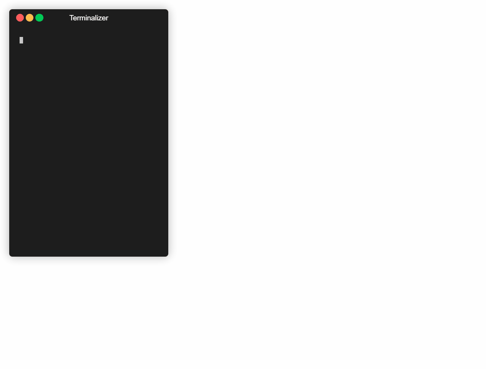

# Medabots #


Medabots is a text based console RPG game. User can move through procedurally 
generated levels to upgrade and modify their character. Gameplay will be loosly 
based on old Medabots games where the user can exchange parts with other 
Medabots that they defeat in battle. Medabots implements a custom 
TextGameEngine API. There are no dependancies to compile this game other than 
the base .NET namespace, `System`.

## TODO ##
* **Downcasting** when rendering gameObjects.
* Render with StringBuilder.
* Press A to interact
* User settings (keybindings)
* Save and load by serialize and deserialize with enc. key

## Game Architecture ##
* **Core Game Engine Components**:
    * `GAME`, `LEVEL`, `USER`, `WMANAGER`, `GDEBUGGER`, `MENU`, `PROMPT`

`Main` module will have a `WindowManager` and `Game` class, which is all the 
games code.
`WindowManager` is publicly available for `Game` class to alter.
`Game` class will adjust the window through `WindowManager`.
`Game` class will inherit `render` and `update` routines to implement custom 
 game code.

Render method will draw the level and player.
Update method will deal with user input.

Level will have a game objects array which includes player.

## User Medabot Customization ##
* Can create medabots from JSON file. Power level must not exceed certain amount
* Use arrow keys to move ; hot keys ; input commands
* Compile and code own characters using medabots API. 

## Gameplay ##
* Can start game through console, continue where left off.
* Procedually generated, advancing level of difficulty.
* Player can encounter with and talk with different medabots. Some medabots can
  help the user and have special functions. Some are just there to battle.
* On player defeat, drop random part or weapon
* ATTACK ITEM RUN
  * ATTACK -> special, main weapon, sub weapon, melee
  * Each has ammo.

## Screenshots ##

Player Message Box:
```
MB_Tournament
============================
|                          |
|@ #              |        |
|                 |        |
|======        !  |        |
|      |          =========|
|      |                   |
|      |               $   |
|       ======      |      |
|             +     |      |
|                   |      |
============================

Messages
----------------------------------------------------------------
* You encounterd a medabot.
* You picked up an item.
* You ran into a wall.
* Command not found.
> Rokusho wants to battle!

User Stats
----------------------------------------------------------------
HP: 10        Speed:   1
Attack: 1     EXP:     0
```


## Battle Mode ## : 
```
(MB_Tournament)
 =============================================
|                                             |
|@ #              |                           |
|                 |                           |
|======        !  |                           |
|      |          =========                   |
|      |                                      |
|      |               $                      |
|       ======      |                         |
|             +     |                         |
|                   |                         |
 =============================================

Messages
----------------------------------------------------------------
* You picked up an item.
* You encounterd a medabot.
* You picked up weapon 'zcannon'.
* Rokusho wants to battle!
> You are now battling Rokusho.

Battle
----------------------------------------------------------------
Attack *       Status
Run            Item
``` 